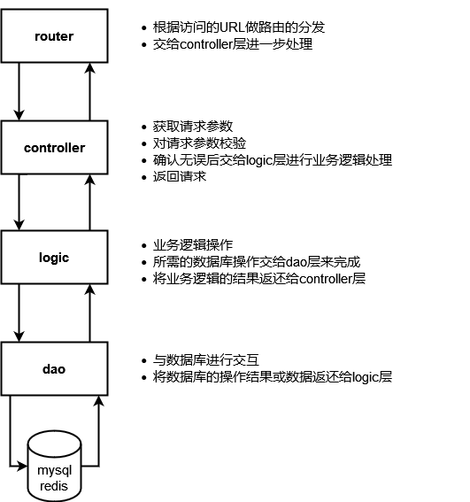
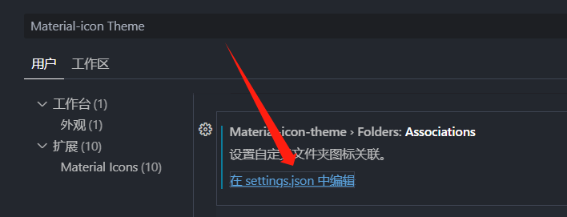
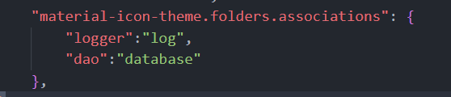
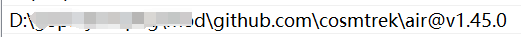

# go_reddit
## 项目描述
使用go语言实现一个类reddit论坛的应用，使用了gin框架，gorm框架等  
数据库使用了mysql以及redis  
该项目用于个人学习go语言以及熟悉golang后端开发
知识来源：  
https://www.liwenzhou.com  
https://space.bilibili.com/4638193
### 基本架构:CLD分层:

### vscode文件夹自定义图标

### AIR热重载，需要去air的根目录生成可执行文件，再去环境变量中配置
go get -u github.com/cosmtrek/air

